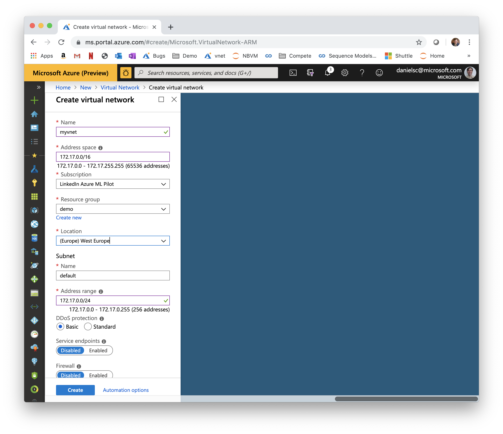
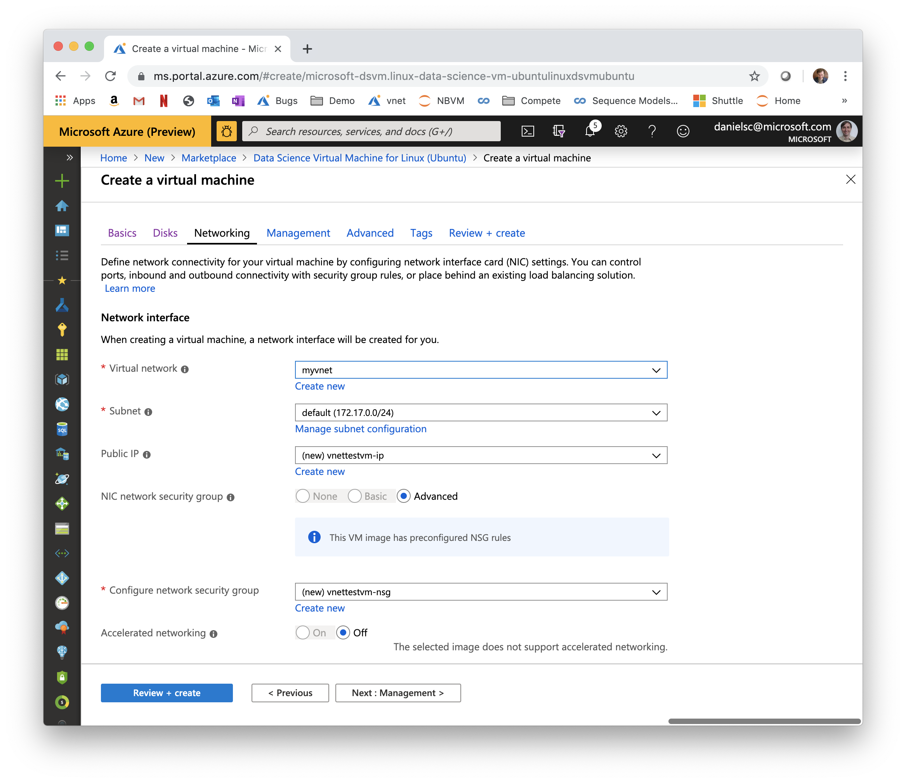
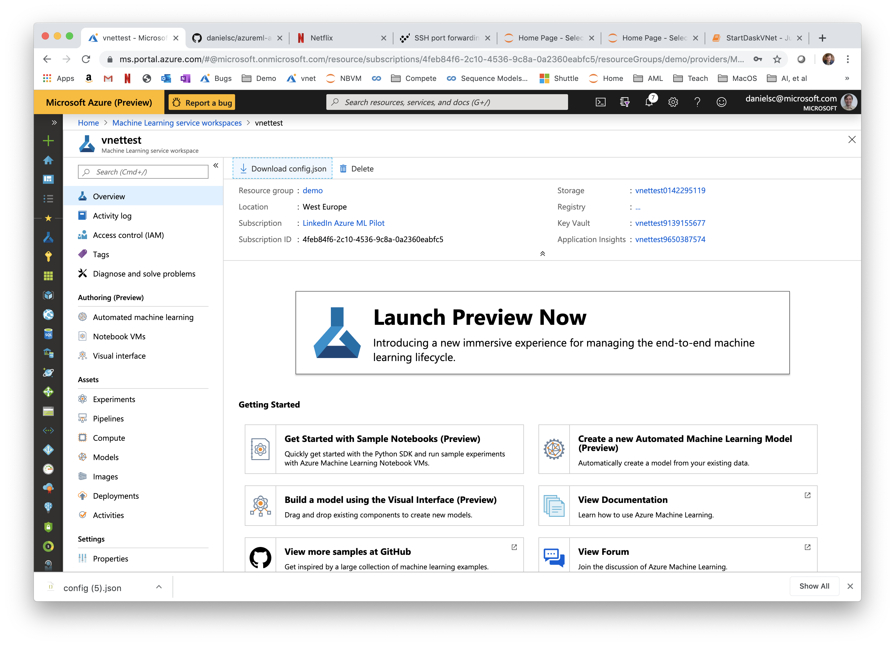

# Setting up a DASK Cluster and a DSVM in a VNet

## Create the VNet




## Create DSVM using the VNet




During setup, it is convenient to use your local username also for the DSVM and to provide your public key during setup, so you can easily ssh onto the VM.
Once the DSVM is created, assign it a DNS name by clicking on the Public IP-Address


And assign it a DNS name, so you can access it by that name (alternatively, you can also switch to a static IP)


Here is some more information on the DSVM: https://docs.microsoft.com/en-us/azure/machine-learning/data-science-virtual-machine/dsvm-ubuntu-intro

Download the config.json from the workspace and upload it to the DSVM (just put it your user's home folder).


```
scp config.json <DNS-name of your DSVM>:
```

Now log in to the DSVM

```
ssh -L 8888:localhost:8888 <DNS-name of your DSVM>
```

On the DSVM, pull down this repository and create the python environment:

```
git clone https://github.com/danielsc/azureml-and-dask
cd azureml-and-dask/
conda env create -f dask/environment.yml
conda activate dask
python -m ipykernel install --user --name dask --display-name "Python (dask)"
```

Next start jupyter on the DSVM:

```
nohup jupyter notebook &
```

Find the login token/url in nohup.out

```
(dask) danielsc@vnettestvm:~/git/azureml-and-dask$ tail nohup.out 
[C 21:17:35.360 NotebookApp] 
    
    To access the notebook, open this file in a browser:
        file:///data/home/danielsc/.local/share/jupyter/runtime/nbserver-18401-open.html
    Or copy and paste one of these URLs:
        http://localhost:8888/?token=6819bfd774eb016e2adc0eab9ec7ad04708058a278dd335f
     or http://127.0.0.1:8888/?token=6819bfd774eb016e2adc0eab9ec7ad04708058a278dd335f
(dask) danielsc@vnettestvm:~/git/azureml-and-dask$ 
```

If you started the ssh session with the port forward as above, then the link above should just work for you (in my case: http://localhost:8888/?token=6819bfd774eb016e2adc0eab9ec7ad04708058a278dd335f).


Now choose [StartDaskVNet.ipynb](StartDaskVNet.ipynb), select the dask kernel you created and run through it.
